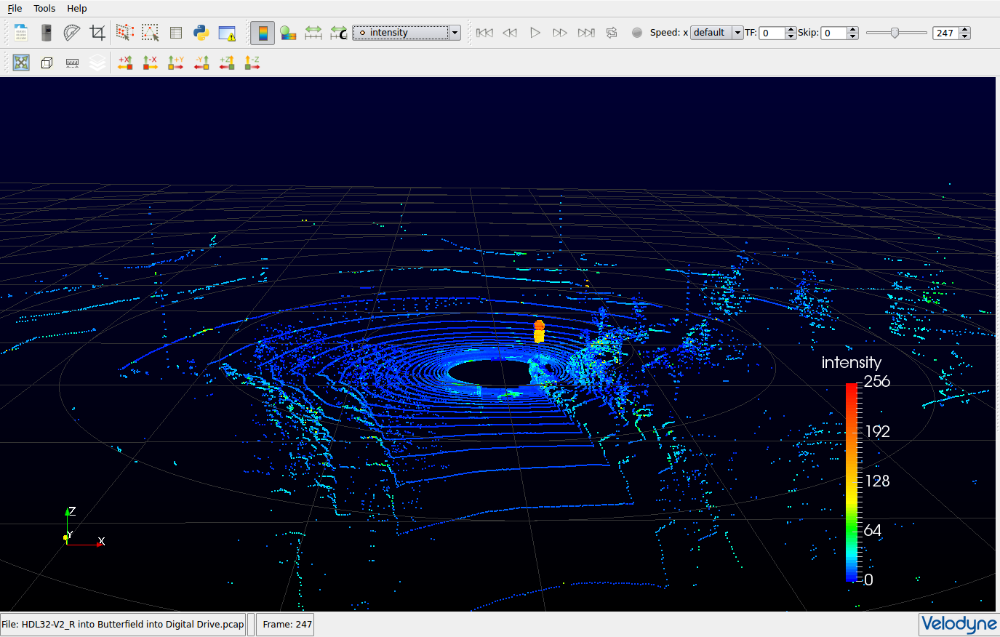

# Lidar
 > *Lidar* is a surveying method that measures distance to a target by illuminating that target with a pulsed laser light, and measuring the reflected pulses with a sensor. Differences in laser return times and wavelengths can then be used to make digital 3-D representations of the target. The name lidar, now considered an acronym of Light Detection And Ranging (sometimes Light Imaging, Detection, And Ranging), was originally a portmanteau of light and radar.

 (Source: [Wikipedia](https://en.wikipedia.org/wiki/Lidar))

## Manufacturers
- [Velodyne LiDAR](http://www.velodynelidar.com/)
- [Quanergy](http://quanergy.com/)
- [Scanse](http://scanse.io/) (2D Sweep Lidar)

## Visualizers
Same datasets are available from Velodyne LiDAR for the [HDL32](https://midas3.kitware.com/midas/folder/12978) and [VLP16](https://midas3.kitware.com/midas/folder/12979). Velodyne uses a `.pcap` file to store their point clouds. Velodyne provides the software [VeloView](https://www.paraview.org/Wiki/VeloView) as a visualizer for their point clouds.  This software is built on top of Kitware's [Paraview](https://www.paraview.org/Wiki/ParaView).

## Software Libraries and Toolsets
- Open Point Cloud Library
